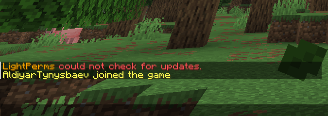
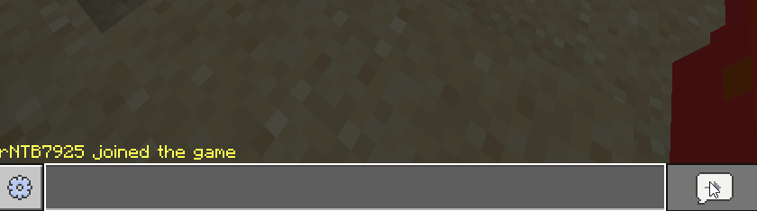
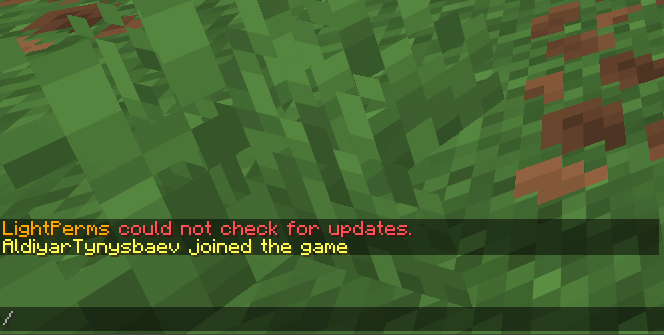
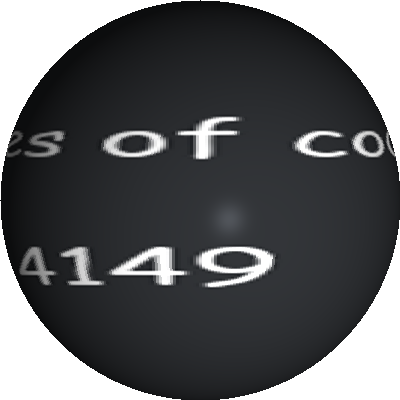

# GeoCountries (ALPHA 0.04)

A Minecraft plugin for Paper servers built from the ground-up which, helps players to simulate diplomacy, trade, wars, and more.
It is intended to work in a similar way to many Factions plugins.

### Tested on Minecraft Versions:
- 1.21.11 (LATEST)

## Current features:

* Country management (`/gc country create`, `dissolve`, `rename`, etc)



* Citizenship system (applications, etc)



* Help command + subcommand help pages



* Debug and admin commands
* Command confirmation and player-plugin chat response system
* Permission groups (`gc.group.essential`, `player`, `admin`)
* Country settings
* Config file (reload command, updating)

## To-do:

* Player settings
* Promoting and demoting players
* Chunk claiming
* Pl3xMap support
* And a lot more sh!te

... Specifically:
```
// todo: revoke citizenship command
// todo: player settings
// todo: in-country ranks
// todo: promote command
// todo: gui
// todo: claiming (max chunks in config)
```

## Current bugs:

* N/A - that I know of B)
\
\
