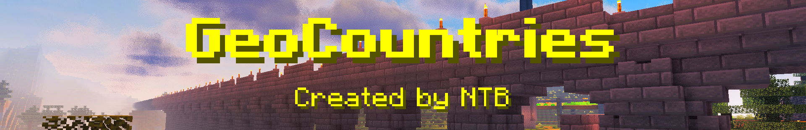
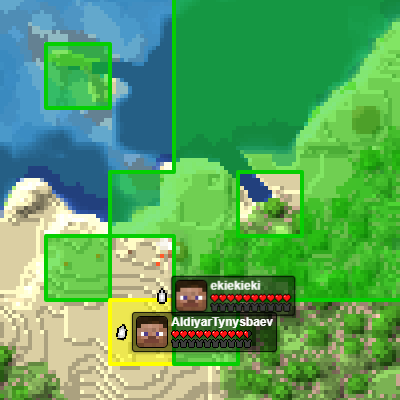

# GeoCountries (ALPHA 0.1)

 

 

## Table of Contents
- [About](#about)
- [Features](#features)
- [Todo](#todo)
- [Known Issues](#known-issues)
- [License](#license)

## About
A Minecraft plugin for Paper servers human-written from the ground-up which helps players to simulate diplomacy, trade, wars, and more.
It is intended to work in a similar way to many existing Factions plugins.

The latest working version of each Minecraft version is:
- 1.21.11: [ALPHA 0.1 (Latest)](https://github.com/GD-NTB/GeoCountries/releases/tag/ALPHA-0.1)

## Features
- Countries (obviously)

- Applying for citizenship of countries

- Factions (alliances) between countries

- Basic land claiming

- [Pl3xMap](https://github.com/granny/Pl3xMap) integration

- GUI command menu

- Chat prefixes

## Todo
The following are planned upcoming features that may or may not be scrapped in the future.
- Banners for country flags (could show up on Pl3xMap) - (ALPHA 0.11)
- Claim points/credits - (ALPHA 0.11)
- Pl3xMap markers - (ALPHA 0.11)
- Wars between countries
- Vassals and vassalization
- Auction house / some sort of trading

## Known Issues
- N/A

If you encounter an issue or bug, please make sure to open an [issue](https://github.com/GD-NTB/GeoCountries/issues) to report it!

## License

This software is released under the [GNU License](LICENSE.txt).

---

Created by [NTB](https://github.com/GD-NTB)

Contact me: [Discord](https://discord.com/users/322682667646582784), [Email](mailto:lkeat2006@gmail.com)

